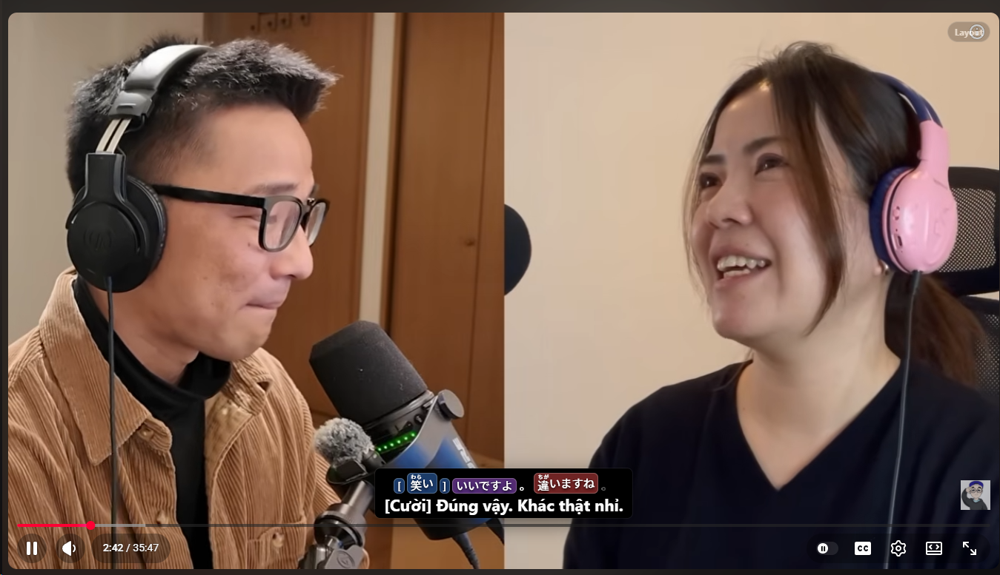
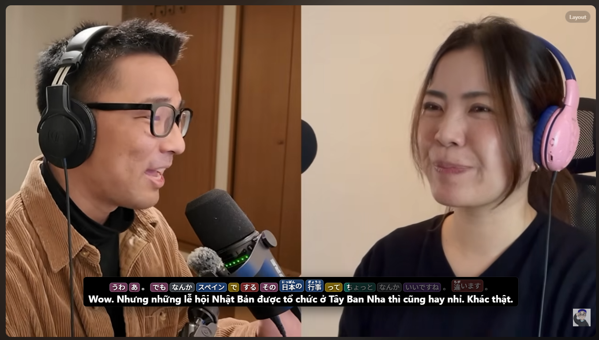
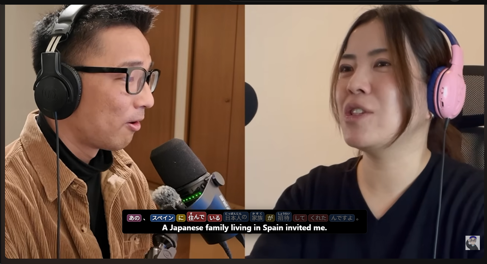
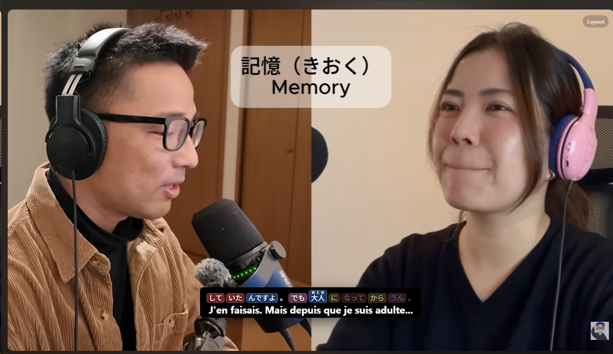

# Context Video Translator

Chrome/Edge MV3 extension for context-aware bilingual subtitles on video-learning platforms.

## Screenshots

<table>
  <tr>
    <td width="50%">
      
      <br><sub><b>Japanese study mode</b> — furigana, token coloring, karaoke progress, and Vietnamese translation.</sub>
    </td>
    <td width="50%">
      
      <br><sub><b>Vietnamese translation</b> — context-aware bilingual subtitles for longer spoken lines.</sub>
    </td>
  </tr>
  <tr>
    <td width="50%">
      
      <br><sub><b>English translation</b> — the source and translated subtitle render atomically.</sub>
    </td>
    <td width="50%">
      
      <br><sub><b>French translation</b> — switch the target language through the extension settings.</sub>
    </td>
  </tr>
</table>

## Highlights

- Context-aware subtitle translation with neighboring cues, not isolated line-by-line translation.
- Atomic bilingual rendering: the source line and translated line update together.
- Black subtitle output background built directly into the subtitle box.
- Separate hard-sub cover layer removed.
- Drag the subtitle output directly in normal mode.
- Fullscreen overlay support for YouTube and Udemy.
- YouTube support via timedtext captions.
- Udemy support via lecture caption API and WebVTT files.
- Netflix coming soon.
- Karaoke progress, dynamic compact height, Japanese study mode, furigana, and local translation cache.

## Supported platforms

| Platform | Status | Notes |
|---|---:|---|
| YouTube | Supported | timedtext captions, json3/XML parsing, segment timing, fullscreen overlay. |
| Udemy | Supported | lecture captions API, signed WebVTT, stable render state, fullscreen remount. |
| Netflix | Coming soon | Planned as a separate adapter. |

## Subtitle output behavior

The subtitle output is now the only visual subtitle layer. It has a configurable black background and can be dragged directly.

- no separate mask layer;
- no glass blur;
- configurable black background opacity;
- normal-mode drag to reposition;
- editor mode for resizing;
- fullscreen remounting;
- atomic bilingual updates, so source text is not shown alone while translation is pending.

## Keyboard shortcuts

```text
Alt+E        Toggle subtitle output layout editor
Alt+S        Save current layout
Esc          Cancel editor
Arrow keys   Move subtitle output
Shift+Arrow  Resize subtitle output
```

In normal mode, hover the subtitle output and drag it to reposition. The new position is saved for the current video or lecture.

## Default provider

```text
Base URL: http://localhost:20128/v1
Model: cx/gpt-5.4-mini
Target language: Vietnamese
```

## Build

```bash
npm install
npm run build
```

Build output goes to `dist/`.

## Load in Chrome or Edge

1. Open `chrome://extensions` or `edge://extensions`.
2. Enable Developer mode.
3. Run `npm run build` if `dist/` does not exist.
4. Click Load unpacked.
5. Select the `dist/` folder.

## Repository hygiene

Do not commit:

```text
node_modules/
dist/
.env
src/vendor/kuromoji/
```

## Project structure

```text
src/
  manifest.json
  background.js
  youtube-main.js
  udemy-main.js
  youtube-content.js
  options.*
scripts/
  build.mjs
```

## Limitations

- Requires the platform to expose captions or transcripts.
- Translation quality and latency depend on the configured model/provider.
- Platform DOM/API changes may require adapter updates.
